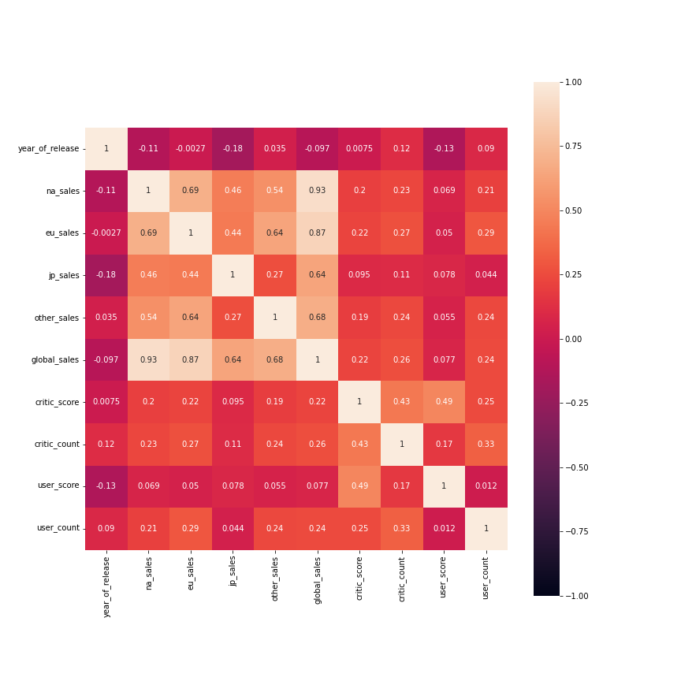
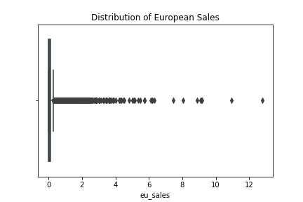
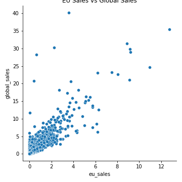
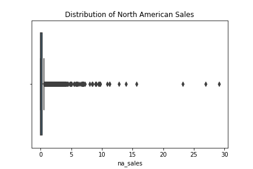
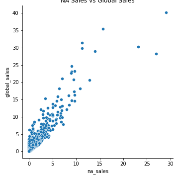
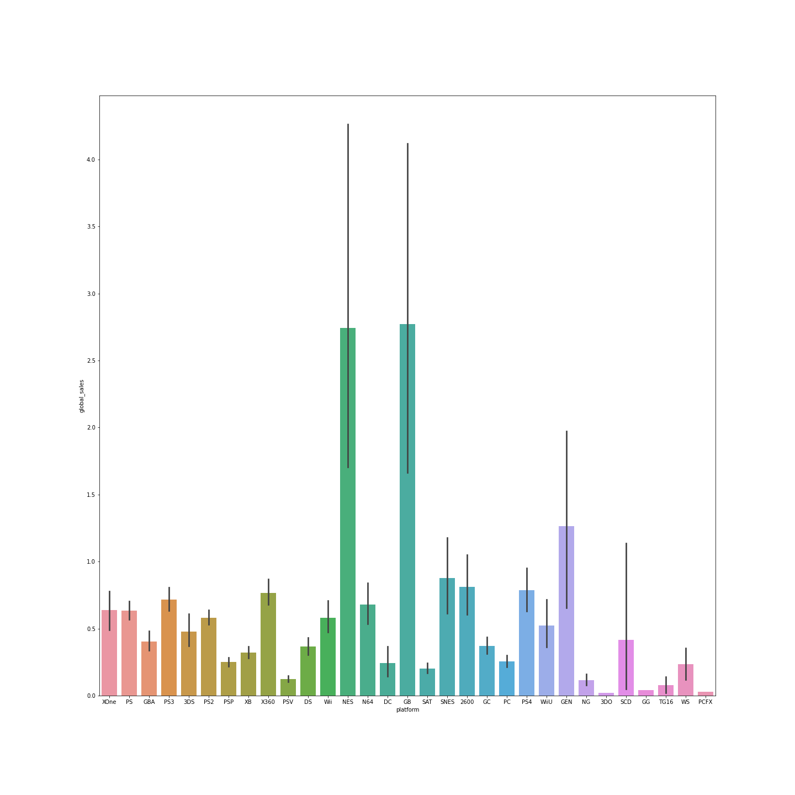

# Restaurant Revenue Prediction

## Problem Statement

Gaming analytics company wants to understand the gaming market better. They want a model to predict the global sales of video games to provide better service to their constumers. Goal is to get the lowest RMSE possible.

## Data Dictionary

|Feature|Type|Dataset|Description|
|---|---|---|---|
|**name**|*string*|train/test|Name of the game|
|**platform**|*string*|train/test|Console on which the game is running|
|**year_of_release**|*float*|train/test|Year of the game released|
|**genre**|*string*|train/test|Game's category|
|**publisher**|*string*|train/test|Game's publisher|
|**developer**|*string*|train/test|Party responsible for creating the game|
|**rating**|*string*|train/test|The ESRB ratings|
|**na_sales**|*float*|train/test|Game sales in North America (in millions of units)|
|**eu_sales**|*float*|train/test|Game sales in European Union (in millions of units)|
|**jp_sales**|*float*|train/test|Game sales in Japan (in millions of units)|
|**other_sales**|*float*|train/test|Game sales in the rest of the world (in millions of units)|
|**critic_score**|*int*|train/test|Aggregate score compiled by Metacritic staff|
|**critic_count**|*int*|train/test|The number of critics used in coming up with the critic score|
|**user_score**|*float*|train/test|The number of critics used in coming up with the Critic score|
|**user_count**|*float*|train/test|Score by Metacritic's subscribers|

([data source](https://www.kaggle.com/rush4ratio/video-game-sales-with-ratings))

## Summary of Analysis

## Data Cleaning
The total data set had 16,719 records. Approximately half of the critic score, critic count, user score, user count, rating, and developer were missing. Initially I planned to scrape the data from the Metacritic website, but was unable to due to Metacritics security. Instead, I filled missing developers with unknown, filled missing ratings with 'E' for everyone as that's the most common rating, and imputed the remaining data based on the median due to the high amount of outliers.

### Data Exploration

North American and European Union sales came out to be the most correlated and significant in determining global sales

The European Union sales had a lot of outliers.

The European Union sales were very linearly related to global sales. As European sales went up so did global sales.

The North American sales had a lot of outliers.

The North American sales were also very linearly related to global sales. As European sales went up so did global sales.

Gameboy has the highest global sales, followed by NES, then Sega Genesis.

## Conclusions
Overall none of the models were able to outperform the baseline score of 0.53 million. The final RMSE that I was able to attain is 0.63 million. This is actually very close to the baseline, so there is potential for room improvement.

The most important features according to this model are the publisher/developer, North American Sales, and European sales. This aligns with the data exploration I conducted, which means the model is picking modeling the data relatively well. 

With a little bit more exploration on model development I believe there's a possiblity to lower the RMSE below the baseline score. If I were to continue model development I would try using a voting classifier with Random Forest and XGBoost.

Some suprising finds were that Platform or Rating were not picked as top significant features, given that Nintendo WII, Playstation, Xbox, and PC are the top platforms and E and M rated games have the most global sales. 